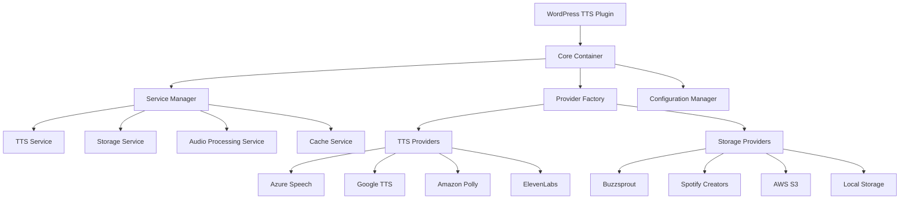
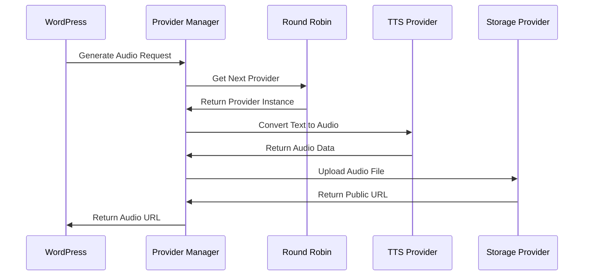
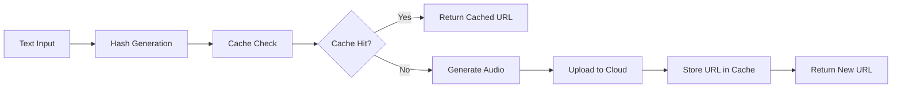

# WordPress TTS Plugin - Comprehensive Architectural Plan

## Table of Contents
1. [Plugin Architecture Design](#1-plugin-architecture-design)
2. [Database Schema Design](#2-database-schema-design)
3. [API Integration Strategy](#3-api-integration-strategy)
4. [WordPress Integration Plan](#4-wordpress-integration-plan)
5. [Security Architecture](#5-security-architecture)
6. [Caching Strategy](#6-caching-strategy)
7. [Error Handling Framework](#7-error-handling-framework)
8. [File Structure](#8-file-structure)
9. [Development Workflow](#9-development-workflow)
10. [Scalability Considerations](#10-scalability-considerations)

---

## 1. Plugin Architecture Design

### Core Architecture Pattern
The plugin follows a **Service-Oriented Architecture (SOA)** with **Dependency Injection** and **Strategy Pattern** for provider management.



### Main Classes and Interfaces

#### Core Container
- **`WP_TTS_Plugin`** - Main plugin class with dependency injection container
- **`ServiceContainer`** - DI container for service management
- **`ConfigurationManager`** - Centralized configuration handling

#### Service Layer
- **`TTSServiceInterface`** - Contract for TTS providers
- **`StorageServiceInterface`** - Contract for storage providers
- **`AudioProcessingService`** - Audio enhancement and processing
- **`CacheService`** - Caching layer management

#### Provider Implementations
- **`AzureSpeechProvider`** - Microsoft Azure integration
- **`GoogleTTSProvider`** - Google Cloud TTS integration
- **`BuzzsproutProvider`** - Buzzsprout API integration

### Design Patterns Used
- **Strategy Pattern**: For interchangeable TTS and storage providers
- **Factory Pattern**: For provider instantiation
- **Dependency Injection**: For loose coupling and testability
- **Observer Pattern**: For event-driven audio generation
- **Command Pattern**: For queued audio processing

---

## 2. Database Schema Design

### WordPress Meta-Based Approach
Using WordPress native storage for rapid development and simplicity.

#### Post Meta Fields
```php
// Per-post TTS configuration
'_tts_enabled' => boolean              // Whether TTS is enabled for this post
'_tts_voice_provider' => string        // Selected TTS provider (azure, google, etc.)
'_tts_voice_id' => string             // Specific voice ID from provider
'_tts_custom_text' => text            // Custom text for TTS (if different from post content)
'_tts_audio_url' => string            // Generated audio file URL
'_tts_audio_duration' => integer      // Audio duration in seconds
'_tts_intro_audio' => string          // Intro audio file URL
'_tts_background_music' => string     // Background music file URL
'_tts_outro_audio' => string          // Outro audio file URL
'_tts_generation_status' => string    // Status: pending, processing, completed, failed
'_tts_last_generated' => datetime     // Last generation timestamp
'_tts_file_hash' => string           // Hash of content for cache validation
'_tts_provider_metadata' => array     // Provider-specific metadata
```

#### WordPress Options
```php
// Global plugin configuration
'wp_tts_providers_config' => array([
    'azure' => [
        'enabled' => true,
        'api_key' => 'encrypted_key',
        'region' => 'eastus',
        'default_voice' => 'es-MX-DaliaNeural'
    ],
    'google' => [
        'enabled' => true,
        'credentials_json' => 'encrypted_json',
        'default_voice' => 'es-US-Neural2-A'
    ]
])

'wp_tts_default_settings' => array([
    'default_provider' => 'azure',
    'auto_generate' => false,
    'voice_speed' => 1.0,
    'voice_pitch' => 0,
    'audio_format' => 'mp3'
])

'wp_tts_round_robin_state' => array([
    'current_provider' => 'azure',
    'usage_count' => [
        'azure' => 1250,
        'google' => 890,
        'polly' => 2100
    ],
    'last_reset' => '2024-01-01'
])

'wp_tts_cache_settings' => array([
    'cache_duration' => 86400,  // 24 hours
    'max_cache_size' => 100,    // Max cached URLs
    'cleanup_interval' => 3600   // Cleanup every hour
])

'wp_tts_audio_library' => array([
    'intro_files' => ['intro1.mp3', 'intro2.mp3'],
    'background_music' => ['bg1.mp3', 'bg2.mp3'],
    'outro_files' => ['outro1.mp3', 'outro2.mp3']
])
```

---

## 3. API Integration Strategy

### Provider Management System



### Provider Interface Contracts

#### TTS Provider Interface
```php
interface TTSProviderInterface {
    /**
     * Convert text to audio
     */
    public function synthesize(string $text, array $options): AudioResult;
    
    /**
     * Get available voices for the provider
     */
    public function getAvailableVoices(): array;
    
    /**
     * Validate API credentials
     */
    public function validateCredentials(): bool;
    
    /**
     * Get remaining quota (if available)
     */
    public function getRemainingQuota(): ?int;
    
    /**
     * Get provider-specific configuration schema
     */
    public function getConfigSchema(): array;
}
```

#### Storage Provider Interface
```php
interface StorageProviderInterface {
    /**
     * Upload audio file to storage
     */
    public function uploadAudio(string $audioData, string $filename): UploadResult;
    
    /**
     * Delete audio file from storage
     */
    public function deleteAudio(string $fileUrl): bool;
    
    /**
     * Get public URL for audio file
     */
    public function getPublicUrl(string $filename): string;
    
    /**
     * Validate storage credentials
     */
    public function validateCredentials(): bool;
}
```

### Provider Factory Pattern
```php
class ProviderFactory {
    private $container;
    
    public function createTTSProvider(string $provider): TTSProviderInterface {
        switch ($provider) {
            case 'azure':
                return new AzureSpeechProvider($this->getProviderConfig($provider));
            case 'google':
                return new GoogleTTSProvider($this->getProviderConfig($provider));
            case 'polly':
                return new AmazonPollyProvider($this->getProviderConfig($provider));
            case 'elevenlabs':
                return new ElevenLabsProvider($this->getProviderConfig($provider));
            default:
                throw new InvalidProviderException("Unknown TTS provider: {$provider}");
        }
    }
    
    public function createStorageProvider(string $provider): StorageProviderInterface {
        switch ($provider) {
            case 'buzzsprout':
                return new BuzzsproutProvider($this->getProviderConfig($provider));
            case 'spotify':
                return new SpotifyProvider($this->getProviderConfig($provider));
            case 's3':
                return new AWSS3Provider($this->getProviderConfig($provider));
            case 'local':
                return new LocalStorageProvider($this->getProviderConfig($provider));
            default:
                throw new InvalidProviderException("Unknown storage provider: {$provider}");
        }
    }
}
```

### Round-Robin Implementation
- Track usage per provider in WordPress options
- Automatic failover on quota exhaustion
- Health monitoring with exponential backoff
- Weighted distribution based on quota limits

---

## 4. WordPress Integration Plan

### Admin Interface Integration

#### Menu Structure
```
WordPress Admin
├── TTS Settings
│   ├── Provider Configuration
│   │   ├── TTS Providers (Azure, Google, Polly, ElevenLabs)
│   │   └── Storage Providers (Buzzsprout, Spotify, S3, Local)
│   ├── Default Voice Settings
│   │   ├── Default Provider Selection
│   │   ├── Voice Configuration
│   │   └── Audio Enhancement Settings
│   ├── Audio Library Management
│   │   ├── Intro Audio Files
│   │   ├── Background Music
│   │   └── Outro Audio Files
│   └── Usage Analytics
│       ├── Provider Usage Statistics
│       ├── Cost Tracking
│       └── Error Logs
└── Posts/Pages
    └── TTS Meta Box (per post)
        ├── Enable/Disable TTS
        ├── Voice Selection
        ├── Custom Text Editor
        ├── Audio Enhancement Options
        └── Generation Status
```

### Post Editor Integration

#### TTS Meta Box Features
- **Enable/Disable Toggle**: Per-post TTS activation
- **Voice Selection Dropdown**: Provider and voice selection
- **Custom Text Editor**: TTS-optimized text editing
- **Audio Preview**: Real-time voice preview
- **Enhancement Options**: Intro, background, outro selection
- **Generation Status**: Progress indicator and error display

#### AJAX Functionality
```php
// AJAX endpoints for real-time features
add_action('wp_ajax_tts_preview_voice', [$this, 'previewVoice']);
add_action('wp_ajax_tts_generate_audio', [$this, 'generateAudio']);
add_action('wp_ajax_tts_validate_provider', [$this, 'validateProvider']);
add_action('wp_ajax_tts_get_voices', [$this, 'getAvailableVoices']);
```

### WordPress Hooks and Filters Integration

#### Core WordPress Hooks
```php
// Plugin initialization
add_action('init', [$this, 'initializePlugin']);
add_action('plugins_loaded', [$this, 'loadTextDomain']);

// Admin interface
add_action('admin_menu', [$this, 'addAdminMenus']);
add_action('admin_enqueue_scripts', [$this, 'enqueueAdminScripts']);
add_action('add_meta_boxes', [$this, 'addTTSMetaBox']);
add_action('save_post', [$this, 'saveTTSSettings']);

// Frontend integration
add_action('wp_enqueue_scripts', [$this, 'enqueueFrontendScripts']);
add_filter('the_content', [$this, 'addAudioPlayerToContent']);

// Cron jobs
add_action('wp_tts_cleanup_cache', [$this, 'cleanupExpiredCache']);
add_action('wp_tts_process_queue', [$this, 'processAudioQueue']);
```

#### Custom Hooks for Extensibility
```php
// Before audio generation
do_action('wp_tts_before_generation', $post_id, $settings);

// After successful generation
do_action('wp_tts_after_generation', $post_id, $audio_url);

// Text preprocessing filter
$processed_text = apply_filters('wp_tts_text_preprocessing', $text, $post_id);

// Audio enhancement filter
$enhanced_audio = apply_filters('wp_tts_audio_enhancement', $audio_data, $settings);

// Provider selection filter
$provider = apply_filters('wp_tts_select_provider', $default_provider, $post_id);
```

### Gutenberg Block Integration
```php
// Register TTS audio player block
register_block_type('wp-tts/audio-player', [
    'editor_script' => 'wp-tts-block-editor',
    'editor_style' => 'wp-tts-block-editor',
    'style' => 'wp-tts-block',
    'render_callback' => [$this, 'renderAudioPlayerBlock']
]);
```

---

## 5. Security Architecture

### API Credential Management

#### Secure Credential Storage
```php
class SecureCredentialManager {
    private const ENCRYPTION_METHOD = 'AES-256-CBC';
    
    /**
     * Store encrypted credentials
     */
    public function storeCredentials(string $provider, array $credentials): void {
        $encrypted = $this->encrypt(json_encode($credentials));
        update_option("wp_tts_credentials_{$provider}", $encrypted);
    }
    
    /**
     * Retrieve and decrypt credentials
     */
    public function getCredentials(string $provider): ?array {
        $encrypted = get_option("wp_tts_credentials_{$provider}");
        if (!$encrypted) {
            return null;
        }
        
        $decrypted = $this->decrypt($encrypted);
        return $decrypted ? json_decode($decrypted, true) : null;
    }
    
    /**
     * Validate credentials without storing
     */
    public function validateCredentials(string $provider, array $credentials): bool {
        $providerInstance = $this->providerFactory->createTTSProvider($provider);
        return $providerInstance->validateCredentials($credentials);
    }
    
    private function encrypt(string $data): string {
        $key = $this->getEncryptionKey();
        $iv = openssl_random_pseudo_bytes(16);
        $encrypted = openssl_encrypt($data, self::ENCRYPTION_METHOD, $key, 0, $iv);
        return base64_encode($iv . $encrypted);
    }
    
    private function decrypt(string $data): ?string {
        $key = $this->getEncryptionKey();
        $data = base64_decode($data);
        $iv = substr($data, 0, 16);
        $encrypted = substr($data, 16);
        return openssl_decrypt($encrypted, self::ENCRYPTION_METHOD, $key, 0, $iv);
    }
    
    private function getEncryptionKey(): string {
        return hash('sha256', wp_salt('secure_auth') . wp_salt('nonce'));
    }
}
```

### Security Measures

#### Access Control
```php
class SecurityManager {
    /**
     * Check if user can manage TTS settings
     */
    public function canManageSettings(): bool {
        return current_user_can('manage_options');
    }
    
    /**
     * Check if user can generate TTS for posts
     */
    public function canGenerateTTS(int $post_id = null): bool {
        if ($post_id) {
            return current_user_can('edit_post', $post_id);
        }
        return current_user_can('edit_posts');
    }
    
    /**
     * Verify nonce for AJAX requests
     */
    public function verifyAjaxNonce(string $action): bool {
        return wp_verify_nonce($_POST['nonce'] ?? '', "wp_tts_{$action}");
    }
}
```

#### Input Validation and Sanitization
```php
class InputValidator {
    public function sanitizeTextForTTS(string $text): string {
        // Remove harmful content
        $text = wp_strip_all_tags($text);
        
        // Normalize whitespace
        $text = preg_replace('/\s+/', ' ', $text);
        
        // Remove potentially problematic characters
        $text = preg_replace('/[^\p{L}\p{N}\p{P}\p{Z}]/u', '', $text);
        
        return trim($text);
    }
    
    public function validateProviderConfig(string $provider, array $config): array {
        $schema = $this->getProviderSchema($provider);
        return $this->validateAgainstSchema($config, $schema);
    }
}
```

#### Rate Limiting
```php
class RateLimiter {
    public function canMakeRequest(string $provider, string $user_id = null): bool {
        $key = "wp_tts_rate_limit_{$provider}_{$user_id}";
        $requests = get_transient($key) ?: 0;
        
        $limit = $this->getProviderRateLimit($provider);
        return $requests < $limit;
    }
    
    public function recordRequest(string $provider, string $user_id = null): void {
        $key = "wp_tts_rate_limit_{$provider}_{$user_id}";
        $requests = get_transient($key) ?: 0;
        set_transient($key, $requests + 1, HOUR_IN_SECONDS);
    }
}
```

---

## 6. Caching Strategy

### Minimal Local Caching Architecture



### Cache Implementation

#### Minimal Cache Service
```php
class MinimalCacheService implements CacheServiceInterface {
    private const CACHE_PREFIX = 'wp_tts_cache_';
    private const DEFAULT_EXPIRATION = 86400; // 24 hours
    
    /**
     * Get cached audio URL by text hash
     */
    public function getCachedAudio(string $textHash): ?string {
        $cacheKey = self::CACHE_PREFIX . $textHash;
        return get_transient($cacheKey);
    }
    
    /**
     * Cache audio URL with metadata
     */
    public function cacheAudioUrl(string $textHash, string $url, int $duration = null): void {
        $cacheKey = self::CACHE_PREFIX . $textHash;
        $cacheData = [
            'url' => $url,
            'duration' => $duration,
            'created_at' => time(),
            'provider' => $this->getCurrentProvider()
        ];
        
        $expiration = $duration ?: self::DEFAULT_EXPIRATION;
        set_transient($cacheKey, $cacheData, $expiration);
        
        // Track cache entry for cleanup
        $this->addToCacheIndex($textHash, $expiration);
    }
    
    /**
     * Generate hash for text content
     */
    public function generateTextHash(string $text, array $options = []): string {
        $hashData = [
            'text' => $this->normalizeText($text),
            'voice' => $options['voice'] ?? '',
            'provider' => $options['provider'] ?? '',
            'speed' => $options['speed'] ?? 1.0,
            'pitch' => $options['pitch'] ?? 0
        ];
        
        return hash('sha256', serialize($hashData));
    }
    
    /**
     * Clean expired cache entries
     */
    public function cleanExpiredCache(): int {
        $cacheIndex = get_option('wp_tts_cache_index', []);
        $cleaned = 0;
        
        foreach ($cacheIndex as $hash => $expiration) {
            if (time() > $expiration) {
                delete_transient(self::CACHE_PREFIX . $hash);
                unset($cacheIndex[$hash]);
                $cleaned++;
            }
        }
        
        update_option('wp_tts_cache_index', $cacheIndex);
        return $cleaned;
    }
    
    /**
     * Get cache statistics
     */
    public function getCacheStats(): array {
        $cacheIndex = get_option('wp_tts_cache_index', []);
        return [
            'total_entries' => count($cacheIndex),
            'expired_entries' => $this->countExpiredEntries($cacheIndex),
            'cache_size_mb' => $this->estimateCacheSize($cacheIndex)
        ];
    }
}
```

### Cache Strategy Details

#### Cache Key Generation
- **Text Content Hashing**: SHA-256 hash of normalized text + voice options
- **Provider-Specific**: Include provider and voice settings in hash
- **Version Control**: Include plugin version for cache invalidation

#### Cache Storage
- **WordPress Transients**: For temporary URL storage (24-48 hours)
- **Metadata Only**: Store URLs and metadata, not audio files
- **Index Tracking**: Maintain cache index for efficient cleanup

#### Cache Cleanup
```php
// Scheduled cleanup via WordPress cron
add_action('wp_tts_cache_cleanup', [$cacheService, 'cleanExpiredCache']);

// Register cleanup schedule
if (!wp_next_scheduled('wp_tts_cache_cleanup')) {
    wp_schedule_event(time(), 'hourly', 'wp_tts_cache_cleanup');
}
```

---

## 7. Error Handling Framework

### Comprehensive Error Management

#### Error Handler Class
```php
class TTSErrorHandler {
    const ERROR_TYPES = [
        'PROVIDER_UNAVAILABLE' => 'Provider service unavailable',
        'QUOTA_EXCEEDED' => 'API quota exceeded',
        'INVALID_CREDENTIALS' => 'Invalid API credentials',
        'UPLOAD_FAILED' => 'Audio upload failed',
        'GENERATION_FAILED' => 'Audio generation failed',
        'NETWORK_ERROR' => 'Network connection error',
        'INVALID_TEXT' => 'Invalid text content',
        'UNSUPPORTED_VOICE' => 'Unsupported voice selection'
    ];
    
    /**
     * Handle different types of errors
     */
    public function handleError(string $type, Exception $exception, array $context = []): ErrorResponse {
        $this->logError($type, $exception, $context);
        
        $recovery = $this->getErrorRecoveryStrategy($type);
        if ($recovery && is_callable($recovery)) {
            return $recovery($exception, $context);
        }
        
        return new ErrorResponse($type, $exception->getMessage(), false);
    }
    
    /**
     * Log errors with context
     */
    public function logError(string $type, Exception $exception, array $context = []): void {
        $logData = [
            'type' => $type,
            'message' => $exception->getMessage(),
            'file' => $exception->getFile(),
            'line' => $exception->getLine(),
            'context' => $context,
            'timestamp' => current_time('mysql'),
            'user_id' => get_current_user_id()
        ];
        
        // Log to WordPress debug log if enabled
        if (WP_DEBUG_LOG) {
            error_log('WP TTS Error: ' . json_encode($logData));
        }
        
        // Store in database for admin review
        $this->storeErrorLog($logData);
    }
    
    /**
     * Get recovery strategy for error type
     */
    public function getErrorRecoveryStrategy(string $errorType): ?callable {
        $strategies = [
            'PROVIDER_UNAVAILABLE' => [$this, 'handleProviderFailover'],
            'QUOTA_EXCEEDED' => [$this, 'handleQuotaExceeded'],
            'NETWORK_ERROR' => [$this, 'handleNetworkError'],
            'UPLOAD_FAILED' => [$this, 'handleUploadFailure']
        ];
        
        return $strategies[$errorType] ?? null;
    }
    
    /**
     * Handle provider failover
     */
    private function handleProviderFailover(Exception $exception, array $context): ErrorResponse {
        $roundRobin = $this->container->get('RoundRobinManager');
        $nextProvider = $roundRobin->getNextAvailableProvider();
        
        if ($nextProvider) {
            // Mark current provider as temporarily unavailable
            $roundRobin->markProviderUnavailable($context['provider'], 300); // 5 minutes
            
            // Retry with next provider
            return new ErrorResponse('PROVIDER_UNAVAILABLE', 'Retrying with alternative provider', true, [
                'retry_provider' => $nextProvider
            ]);
        }
        
        return new ErrorResponse('PROVIDER_UNAVAILABLE', 'No alternative providers available', false);
    }
    
    /**
     * Handle quota exceeded
     */
    private function handleQuotaExceeded(Exception $exception, array $context): ErrorResponse {
        $roundRobin = $this->container->get('RoundRobinManager');
        
        // Mark provider quota as exceeded
        $roundRobin->markQuotaExceeded($context['provider']);
        
        // Try next provider
        $nextProvider = $roundRobin->getNextAvailableProvider();
        if ($nextProvider) {
            return new ErrorResponse('QUOTA_EXCEEDED', 'Switching to alternative provider', true, [
                'retry_provider' => $nextProvider
            ]);
        }
        
        return new ErrorResponse('QUOTA_EXCEEDED', 'All provider quotas exceeded', false);
    }
}
```

### Error Recovery Strategies

#### Automatic Failover
- **Provider Switching**: Automatic switch to next available provider
- **Exponential Backoff**: Increasing delays for repeated failures
- **Circuit Breaker**: Temporarily disable failing providers

#### User Notification
```php
class UserNotificationManager {
    public function notifyError(string $errorType, string $message, int $postId = null): void {
        // Admin notices for immediate feedback
        add_action('admin_notices', function() use ($message) {
            echo "<div class='notice notice-error'><p>{$message}</p></div>";
        });
        
        // Email notification for critical errors
        if ($this->isCriticalError($errorType)) {
            $this->sendEmailNotification($errorType, $message, $postId);
        }
    }
    
    private function isCriticalError(string $errorType): bool {
        return in_array($errorType, ['INVALID_CREDENTIALS', 'PROVIDER_UNAVAILABLE']);
    }
}
```

#### Retry Mechanisms
```php
class RetryManager {
    private const MAX_RETRIES = 3;
    private const RETRY_DELAYS = [1, 5, 15]; // seconds
    
    public function executeWithRetry(callable $operation, array $context = []): mixed {
        $lastException = null;
        
        for ($attempt = 0; $attempt < self::MAX_RETRIES; $attempt++) {
            try {
                return $operation();
            } catch (Exception $e) {
                $lastException = $e;
                
                if ($attempt < self::MAX_RETRIES - 1) {
                    sleep(self::RETRY_DELAYS[$attempt]);
                    
                    // Log retry attempt
                    $this->logRetryAttempt($attempt + 1, $e, $context);
                }
            }
        }
        
        throw $lastException;
    }
}
```

---

## 8. File Structure

```
wp-tts-plugin/
├── wp-tts-plugin.php                 # Main plugin file with header and activation
├── composer.json                     # Dependencies and PSR-4 autoloading
├── composer.lock                     # Locked dependency versions
├── README.md                         # Plugin documentation
├── CHANGELOG.md                      # Version history
├── LICENSE                           # Plugin license
├── .gitignore                        # Git ignore rules
├── phpunit.xml                       # PHPUnit configuration
├── assets/                           # Frontend and admin assets
│   ├── css/
│   │   ├── admin.css                 # Admin interface styles
│   │   ├── meta-box.css             # Post meta box styles
│   │   └── frontend.css             # Frontend audio player styles
│   ├── js/
│   │   ├── admin.js                 # Admin interface JavaScript
│   │   ├── meta-box.js              # Post meta box functionality
│   │   ├── audio-player.js          # Frontend audio player
│   │   └── voice-preview.js         # Voice preview functionality
│   ├── images/
│   │   ├── provider-logos/          # TTS provider logos
│   │   └── icons/                   # UI icons
│   └── audio/                       # Default audio files
│       ├── intro/                   # Default intro files
│       ├── background/              # Default background music
│       └── outro/                   # Default outro files
├── languages/                        # Internationalization files
│   ├── wp-tts-plugin.pot           # Translation template
│   ├── wp-tts-plugin-es_ES.po      # Spanish translation
│   └── wp-tts-plugin-es_MX.po      # Mexican Spanish translation
├── src/                              # Core PHP classes (PSR-4 autoloaded)
│   ├── Core/
│   │   ├── Plugin.php               # Main plugin class
│   │   ├── ServiceContainer.php     # Dependency injection container
│   │   ├── ConfigurationManager.php # Configuration management
│   │   ├── Activator.php           # Plugin activation logic
│   │   └── Deactivator.php         # Plugin deactivation logic
│   ├── Interfaces/
│   │   ├── TTSProviderInterface.php # TTS provider contract
│   │   ├── StorageProviderInterface.php # Storage provider contract
│   │   ├── CacheServiceInterface.php # Cache service contract
│   │   └── AudioProcessorInterface.php # Audio processing contract
│   ├── Services/
│   │   ├── TTSService.php           # Main TTS orchestration service
│   │   ├── AudioProcessingService.php # Audio enhancement and processing
│   │   ├── CacheService.php         # Caching implementation
│   │   ├── RoundRobinManager.php    # Provider rotation logic
│   │   ├── QueueManager.php         # Background processing queue
│   │   └── AnalyticsService.php     # Usage analytics and reporting
│   ├── Providers/
│   │   ├── TTS/
│   │   │   ├── AbstractTTSProvider.php # Base TTS provider class
│   │   │   ├── AzureSpeechProvider.php # Microsoft Azure Speech
│   │   │   ├── GoogleTTSProvider.php   # Google Cloud TTS
│   │   │   ├── AmazonPollyProvider.php # Amazon Polly
│   │   │   └── ElevenLabsProvider.php  # ElevenLabs API
│   │   └── Storage/
│   │       ├── AbstractStorageProvider.php # Base storage provider
│   │       ├── BuzzsproutProvider.php      # Buzzsprout integration
│   │       ├── SpotifyProvider.php         # Spotify for Creators
│   │       ├── AWSS3Provider.php          # AWS S3 storage
│   │       └── LocalStorageProvider.php   # Local file storage
│   ├── Admin/
│   │   ├── AdminInterface.php       # Main admin interface controller
│   │   ├── Sett
│   │   ├── SettingsPage.php         # Settings page controller
│   │   ├── MetaBox.php             # Post meta box implementation
│   │   ├── AjaxHandler.php         # AJAX request handler
│   │   └── MenuManager.php         # Admin menu management
│   ├── Frontend/
│   │   ├── AudioPlayer.php         # Frontend audio player
│   │   ├── ShortcodeHandler.php    # Shortcode implementation
│   │   └── BlockRenderer.php       # Gutenberg block renderer
│   ├── Utils/
│   │   ├── TextProcessor.php       # Text preprocessing for TTS
│   │   ├── AudioEnhancer.php       # Audio enhancement utilities
│   │   ├── SecurityManager.php     # Security and validation
│   │   ├── Logger.php              # Logging utilities
│   │   ├── FileManager.php         # File handling utilities
│   │   └── ApiClient.php           # HTTP client for API calls
│   └── Exceptions/
│       ├── TTSException.php        # Base TTS exception
│       ├── ProviderException.php   # Provider-specific exceptions
│       ├── StorageException.php    # Storage-related exceptions
│       ├── ValidationException.php # Input validation exceptions
│       └── ConfigurationException.php # Configuration errors
├── templates/                       # PHP template files
│   ├── admin/
│   │   ├── settings-page.php       # Main settings page template
│   │   ├── provider-config.php     # Provider configuration form
│   │   ├── voice-settings.php      # Voice configuration form
│   │   ├── audio-library.php       # Audio library management
│   │   ├── analytics.php           # Usage analytics display
│   │   └── meta-box.php            # Post meta box template
│   └── frontend/
│       ├── audio-player.php        # Audio player template
│       └── shortcode-output.php    # Shortcode output template
├── tests/                          # Test suite
│   ├── Unit/                       # Unit tests
│   │   ├── Services/
│   │   ├── Providers/
│   │   └── Utils/
│   ├── Integration/                # Integration tests
│   │   ├── WordPressIntegration/
│   │   ├── ProviderIntegration/
│   │   └── APIIntegration/
│   ├── Fixtures/                   # Test data and fixtures
│   └── bootstrap.php               # Test bootstrap file
├── docs/                           # Documentation
│   ├── installation.md             # Installation guide
│   ├── configuration.md            # Configuration guide
│   ├── api-reference.md            # API documentation
│   └── troubleshooting.md          # Troubleshooting guide
└── vendor/                         # Composer dependencies (git-ignored)
```

---

## 9. Development Workflow

### Recommended Development Approach

#### Phase 1: Core Foundation (Weeks 1-2)
**Objectives:**
- Set up modern PHP development environment
- Establish plugin architecture foundation
- Implement dependency injection system

**Tasks:**
1. **Project Setup**
   - Initialize Composer with PSR-4 autoloading
   - Set up PHPUnit testing framework
   - Configure code quality tools (PHPCS, PHPStan)
   - Create basic plugin structure

2. **Core Architecture**
   - Implement `ServiceContainer` with dependency injection
   - Create base interfaces for providers and services
   - Set up `ConfigurationManager` for settings
   - Implement basic WordPress integration hooks

3. **Security Foundation**
   - Implement `SecurityManager` with credential encryption
   - Set up input validation and sanitization
   - Create nonce verification system
   - Implement capability-based access control

**Deliverables:**
- Working plugin skeleton with autoloading
- Basic admin interface framework
- Security layer implementation
- Unit test foundation

#### Phase 2: Provider Integration (Weeks 3-6)
**Objectives:**
- Implement TTS provider integrations
- Create storage provider system
- Build round-robin management

**Tasks:**
1. **TTS Provider Implementation**
   - Week 3: Azure Speech Services (primary provider)
   - Week 4: Google Cloud TTS integration
   - Week 5: Amazon Polly integration
   - Week 6: ElevenLabs integration

2. **Storage Provider Implementation**
   - Buzzsprout API integration (primary)
   - AWS S3 storage provider
   - Local storage fallback
   - Spotify for Creators integration

3. **Provider Management**
   - Round-robin distribution system
   - Health monitoring and failover
   - Quota tracking and management
   - Provider validation system

**Deliverables:**
- All TTS providers functional
- Storage system working
- Round-robin logic implemented
- Provider health monitoring

#### Phase 3: WordPress Integration (Weeks 7-9)
**Objectives:**
- Build comprehensive admin interface
- Implement post editor integration
- Create frontend audio player

**Tasks:**
1. **Admin Interface Development**
   - Settings page with provider configuration
   - Voice testing and preview system
   - Audio library management interface
   - Usage analytics dashboard

2. **Post Editor Integration**
   - TTS meta box for posts/pages
   - AJAX-powered voice preview
   - Custom text editor for TTS
   - Audio enhancement options

3. **Frontend Integration**
   - Audio player shortcode
   - Gutenberg block for audio player
   - Automatic player embedding
   - Responsive player design

**Deliverables:**
- Complete admin interface
- Post editor TTS functionality
- Frontend audio player
- AJAX functionality working

#### Phase 4: Optimization & Testing (Weeks 10-12)
**Objectives:**
- Implement caching and performance optimization
- Comprehensive testing and bug fixes
- Security audit and documentation

**Tasks:**
1. **Performance Optimization**
   - Implement minimal caching system
   - Optimize API call patterns
   - Background processing for large content
   - Database query optimization

2. **Testing and Quality Assurance**
   - Unit test coverage (>80%)
   - Integration testing with real APIs
   - WordPress compatibility testing
   - Performance testing and optimization

3. **Documentation and Deployment**
   - User documentation and guides
   - Developer API documentation
   - Plugin packaging and distribution
   - Initial release preparation

**Deliverables:**
- Optimized and cached system
- Comprehensive test suite
- Complete documentation
- Production-ready plugin

### Testing Strategy

#### Unit Testing
```php
// Example unit test structure
class TTSServiceTest extends WP_UnitTestCase {
    private $ttsService;
    private $mockProvider;
    
    public function setUp(): void {
        parent::setUp();
        $this->mockProvider = $this->createMock(TTSProviderInterface::class);
        $this->ttsService = new TTSService($this->mockProvider);
    }
    
    public function testGenerateAudioSuccess(): void {
        $this->mockProvider
            ->expects($this->once())
            ->method('synthesize')
            ->willReturn(new AudioResult('audio-data', 'mp3'));
            
        $result = $this->ttsService->generateAudio('Test text', []);
        $this->assertInstanceOf(AudioResult::class, $result);
    }
}
```

#### Integration Testing
- Test with real TTS provider APIs (using test credentials)
- WordPress hook and filter integration testing
- Database operations testing
- AJAX endpoint testing

#### Manual Testing Checklist
- [ ] Provider configuration and validation
- [ ] Voice selection and preview
- [ ] Audio generation and storage
- [ ] Round-robin provider switching
- [ ] Error handling and recovery
- [ ] Frontend audio player functionality
- [ ] Mobile responsiveness
- [ ] Performance under load

### Code Quality Standards

#### PHP Standards
- PSR-12 coding standard
- PHPStan level 8 static analysis
- 80%+ unit test coverage
- WordPress Coding Standards compliance

#### JavaScript Standards
- ESLint with WordPress configuration
- Modern ES6+ syntax
- Proper error handling
- Accessibility compliance

#### Documentation Standards
- PHPDoc for all classes and methods
- Inline comments for complex logic
- User-facing documentation
- API reference documentation

---

## 10. Scalability Considerations

### Performance Optimization

#### API Rate Limiting and Management
```php
class AdvancedRateLimiter {
    /**
     * Intelligent rate limiting with provider-specific rules
     */
    public function canMakeRequest(string $provider, string $userId = null): bool {
        $limits = $this->getProviderLimits($provider);
        $usage = $this->getCurrentUsage($provider, $userId);
        
        // Check multiple rate limit windows
        foreach ($limits as $window => $limit) {
            if ($usage[$window] >= $limit) {
                return false;
            }
        }
        
        return true;
    }
    
    /**
     * Predictive quota management
     */
    public function predictQuotaExhaustion(string $provider): ?DateTime {
        $usage = $this->getUsageHistory($provider, 7); // 7 days
        $trend = $this->calculateUsageTrend($usage);
        $remaining = $this->getRemainingQuota($provider);
        
        if ($trend > 0) {
            $daysUntilExhaustion = $remaining / $trend;
            return new DateTime("+{$daysUntilExhaustion} days");
        }
        
        return null;
    }
}
```

#### Asynchronous Processing
```php
class BackgroundProcessor {
    /**
     * Queue audio generation for background processing
     */
    public function queueAudioGeneration(int $postId, array $settings): void {
        $job = [
            'post_id' => $postId,
            'settings' => $settings,
            'priority' => $this->calculatePriority($postId),
            'created_at' => time()
        ];
        
        // Use WordPress cron for background processing
        wp_schedule_single_event(time() + 60, 'wp_tts_process_audio', [$job]);
    }
    
    /**
     * Process queued audio generation jobs
     */
    public function processAudioQueue(): void {
        $jobs = $this->getQueuedJobs();
        
        foreach ($jobs as $job) {
            try {
                $this->processAudioJob($job);
                $this->markJobCompleted($job['id']);
            } catch (Exception $e) {
                $this->handleJobFailure($job, $e);
            }
        }
    }
}
```

### Scalability Features

#### Multi-Site Support
```php
class MultiSiteManager {
    /**
     * Network-wide provider configuration
     */
    public function getNetworkProviderConfig(): array {
        return get_site_option('wp_tts_network_providers', []);
    }
    
    /**
     * Site-specific provider overrides
     */
    public function getSiteProviderConfig(int $siteId = null): array {
        $siteId = $siteId ?: get_current_blog_id();
        return get_blog_option($siteId, 'wp_tts_site_providers', []);
    }
    
    /**
     * Aggregate usage across network
     */
    public function getNetworkUsageStats(): array {
        $sites = get_sites();
        $totalUsage = [];
        
        foreach ($sites as $site) {
            $siteUsage = get_blog_option($site->blog_id, 'wp_tts_usage_stats', []);
            $totalUsage = $this->mergeUsageStats($totalUsage, $siteUsage);
        }
        
        return $totalUsage;
    }
}
```

#### CDN Integration
```php
class CDNManager {
    /**
     * Distribute audio files via CDN
     */
    public function uploadToCDN(string $audioData, string $filename): string {
        $cdnProvider = $this->getCDNProvider();
        
        // Upload to primary CDN
        $primaryUrl = $cdnProvider->upload($audioData, $filename);
        
        // Optional: Upload to backup CDN
        if ($this->hasBackupCDN()) {
            $this->getBackupCDN()->upload($audioData, $filename);
        }
        
        return $primaryUrl;
    }
    
    /**
     * Intelligent CDN selection based on user location
     */
    public function selectOptimalCDN(string $userLocation): string {
        $cdnEndpoints = $this->getCDNEndpoints();
        return $this->findClosestEndpoint($userLocation, $cdnEndpoints);
    }
}
```

### Growth Handling Strategies

#### Database Optimization
```php
class DatabaseOptimizer {
    /**
     * Optimize post meta queries for TTS data
     */
    public function optimizeMetaQueries(): void {
        global $wpdb;
        
        // Add indexes for frequently queried meta keys
        $indexes = [
            "INDEX tts_enabled (_meta_key, _meta_value)",
            "INDEX tts_provider (_meta_key, _meta_value)",
            "INDEX tts_status (_meta_key, _meta_value)"
        ];
        
        foreach ($indexes as $index) {
            $wpdb->query("ALTER TABLE {$wpdb->postmeta} ADD {$index}");
        }
    }
    
    /**
     * Clean up old TTS data
     */
    public function cleanupOldData(int $daysOld = 30): int {
        global $wpdb;
        
        $cutoffDate = date('Y-m-d H:i:s', strtotime("-{$daysOld} days"));
        
        return $wpdb->query($wpdb->prepare("
            DELETE pm FROM {$wpdb->postmeta} pm
            JOIN {$wpdb->posts} p ON pm.post_id = p.ID
            WHERE pm.meta_key LIKE '_tts_%'
            AND p.post_modified < %s
            AND p.post_status = 'trash'
        ", $cutoffDate));
    }
}
```

#### Monitoring and Analytics
```php
class AnalyticsService {
    /**
     * Track usage metrics
     */
    public function trackUsage(string $provider, string $action, array $metadata = []): void {
        $event = [
            'provider' => $provider,
            'action' => $action,
            'metadata' => $metadata,
            'timestamp' => time(),
            'user_id' => get_current_user_id(),
            'site_id' => get_current_blog_id()
        ];
        
        // Store in database
        $this->storeEvent($event);
        
        // Send to external analytics if configured
        if ($this->hasExternalAnalytics()) {
            $this->sendToExternalAnalytics($event);
        }
    }
    
    /**
     * Generate usage reports
     */
    public function generateUsageReport(string $period = 'month'): array {
        $data = $this->getUsageData($period);
        
        return [
            'total_generations' => $data['total_count'],
            'provider_breakdown' => $data['by_provider'],
            'cost_analysis' => $this->calculateCosts($data),
            'performance_metrics' => $this->calculatePerformance($data),
            'recommendations' => $this->generateRecommendations($data)
        ];
    }
}
```

#### Cost Optimization
```php
class CostOptimizer {
    /**
     * Optimize provider selection based on cost
     */
    public function selectCostOptimalProvider(string $text, array $options = []): string {
        $providers = $this->getAvailableProviders();
        $costs = [];
        
        foreach ($providers as $provider) {
            $cost = $this->calculateCost($provider, $text, $options);
            $quality = $this->getQualityScore($provider, $options['language'] ?? 'es-MX');
            
            // Cost-quality ratio
            $costs[$provider] = $cost / $quality;
        }
        
        // Return provider with best cost-quality ratio
        return array_search(min($costs), $costs);
    }
    
    /**
     * Suggest cost-saving optimizations
     */
    public function suggestOptimizations(): array {
        $suggestions = [];
        
        // Analyze usage patterns
        $usage = $this->getUsageAnalysis();
        
        if ($usage['cache_hit_rate'] < 0.7) {
            $suggestions[] = 'Increase cache duration to improve hit rate';
        }
        
        if ($usage['avg_text_length'] > 5000) {
            $suggestions[] = 'Consider text summarization for long articles';
        }
        
        return $suggestions;
    }
}
```

### Future Extensibility

#### Plugin Architecture for Extensions
```php
interface TTSExtensionInterface {
    public function getName(): string;
    public function getVersion(): string;
    public function initialize(ServiceContainer $container): void;
    public function getRequiredCapabilities(): array;
}

class ExtensionManager {
    public function registerExtension(TTSExtensionInterface $extension): void {
        // Register extension with plugin system
        $this->extensions[$extension->getName()] = $extension;
        
        // Initialize extension
        $extension->initialize($this->container);
        
        // Fire extension loaded hook
        do_action('wp_tts_extension_loaded', $extension);
    }
}
```

#### API for Third-Party Integrations
```php
class PublicAPI {
    /**
     * Generate audio via API
     */
    public function generateAudio(WP_REST_Request $request): WP_REST_Response {
        $postId = $request->get_param('post_id');
        $settings = $request->get_param('settings');
        
        // Validate permissions
        if (!current_user_can('edit_post', $postId)) {
            return new WP_Error('insufficient_permissions', 'Cannot generate TTS for this post');
        }
        
        try {
            $result = $this->ttsService->generateAudio($postId, $settings);
            return rest_ensure_response($result);
        } catch (Exception $e) {
            return new WP_Error('generation_failed', $e->getMessage());
        }
    }
}
```

This comprehensive architectural plan provides a solid foundation for building a robust, scalable WordPress TTS plugin that can efficiently handle multiple providers, optimize costs, and grow with user needs while maintaining high performance and reliability standards.